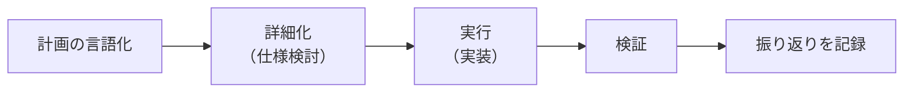

# AIエージェント向けガイドライン（マスター）

> **このファイルは唯一の正規ソース（SSOT）です。**
> 内容を変更する場合は、以下の全サービス向けファイルを必ず同時に更新してください。
>
> - `.github/copilot-instructions.md`（GitHub Copilot）
> - `CLAUDE.md`（Claude Code）
> - `AGENTS.md`（OpenAI Codex / 汎用エージェント）
> - `.kiro/steering/project.md`（Amazon Kiro）

---

## プロジェクト概要

このリポジトリは、AI エージェントが常時稼働できるプラットフォームを調査するためのドキュメントリポジトリです。
とくに **Amazon Bedrock AgentCore** ファミリーを対象とし、実行基盤としての **AgentCore Runtime** に着目します。

主な目的は以下のとおりです。

- AgentCore Runtime の機能・制約・ユースケースの調査と記録
- AI エージェントが参照できる構造化されたドキュメントの整備
- 調査・実装・検証の知見を再利用可能な形式で蓄積する

---

## タスクの進め方

タスクは次のサイクルで反復します。詳細は [`docs/workflow/task-cycle.md`](workflow/task-cycle.md) を参照してください。



### 各フェーズの概要

| フェーズ | 説明 |
|----------|------|
| 計画の言語化 | 何をするかをドキュメントやコメントとして書き出す |
| 詳細化 | 仕様・制約・完了条件を明確化する |
| 実行 | 実装・調査・執筆を行う |
| 検証 | 成果物が完了条件を満たしているか確認する |
| 振り返りを記録 | 学んだことや気づきを `docs/` 配下に記録する |

---

## ドキュメント構造

```
docs/
├── ai-guidelines-master.md      # 全AIサービス向けガイドライン（このファイル・SSOT）
├── masterplan.md                 # プロジェクト全体計画・タスクステータス一覧
└── workflow/
    ├── task-cycle.md             # タスクサイクルの詳細手順
    └── templates/
        └── task.md               # 汎用タスクテンプレート

.github/
└── copilot-instructions.md       # GitHub Copilot 向け常時参照

CLAUDE.md                         # Claude Code 向け常時参照
AGENTS.md                         # OpenAI Codex / 汎用エージェント向け常時参照
.kiro/steering/project.md         # Amazon Kiro 向け常時参照
```

常時参照ファイル（`CLAUDE.md` 等）は要点のみを記載し、詳細はこのファイルへのリンクで参照します。

---

## 言語ルール

- 見出し・ラベル・説明文は**日本語を優先**する
- 技術的な固有名詞・ライブラリ名・コマンド名は英語のままでよい
- コードブロック内のコメントも日本語で記述する

---

## 表現フォーマット規約

### 図・ダイアグラム

- 構造や関係を視覚化する場合は、プレーンテキスト（ASCII アート）ではなく **Mermaid 記法**を使用する
- コードブロックのタグに `mermaid` を指定する（例: ` ```mermaid `）
- 目的に応じて適切なダイアグラムタイプを選択する:

| ダイアグラムタイプ | 用途 | 記法 |
|---------------|------|------|
| フローチャート | 処理フロー・コンポーネント間の関係 | `flowchart TD` / `flowchart LR` |
| シーケンス図 | システム間の時系列インタラクション | `sequenceDiagram` |
| クラス図 | データ構造・オブジェクト関係 | `classDiagram` |
| ER 図 | データモデル | `erDiagram` |

---

## タスク管理ルール

タスクのステータスは [`docs/masterplan.md`](masterplan.md) で一元管理します。

- タスクを追加したときは `masterplan.md` に行を追加し、ステータスを「未着手」にする
- 着手したときはステータスを「進行中」に更新する
- 完了したときはステータスを「完了」に更新し、成果物へのリンクを記載する

---

## 更新ルール

このファイルを更新した場合は、**必ず以下の手順**を踏んでください。

1. `docs/ai-guidelines-master.md`（このファイル）を更新する
2. 変更内容を各サービス向けファイルに反映する
   - `.github/copilot-instructions.md`
   - `CLAUDE.md`
   - `AGENTS.md`
   - `.kiro/steering/project.md`
3. `docs/masterplan.md` の該当タスクを「完了」に更新する
