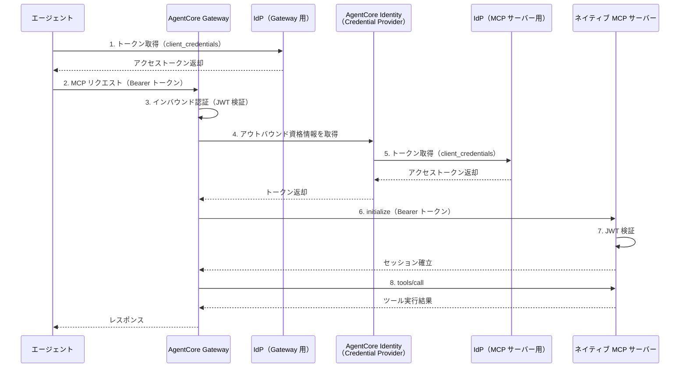
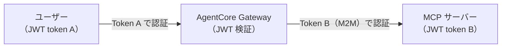
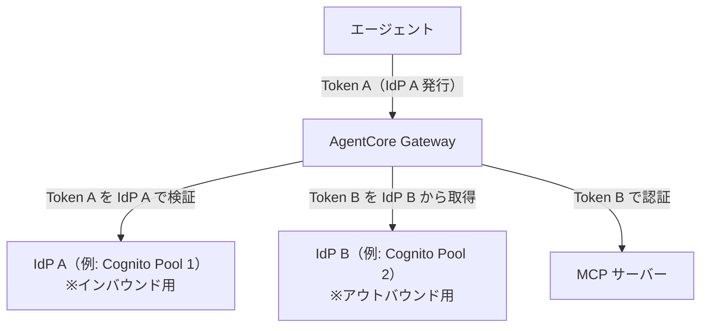

# AgentCore Gateway ネイティブ MCP サーバーの認証認可

> **調査日**: 2026-03-09  
> **情報の鮮度**: 2025年下半期時点の公式情報に基づく

---

## 概要

AgentCore Gateway がネイティブ MCP サーバーをターゲットとしてルーティングする際の認証認可フローを整理します。大きく「インバウンド認証（エージェント → Gateway）」と「アウトバウンド認証（Gateway → MCP サーバー）」の 2 方向があり、それぞれ独立した IdP を使用できます。

---

## 全体フロー



---

## インバウンド認証（エージェント → Gateway）

エージェントが Gateway を呼び出す際の認証方式です。

### サポートする認証スキーム

| 認証タイプ | 設定値 | 備考 |
|------------|--------|------|
| カスタム JWT（OIDC） | `authorizerType: "CUSTOM_JWT"` | 推奨。OIDC 対応 IdP（Cognito 等）を使用 |
| 認証なし | `authorizerType: "NONE"` | 開発・テスト用のみ。本番環境では使用しない |

> **注意**: IAM SigV4 によるインバウンド認証は Runtime への直接アクセスでサポートされますが、Gateway エンドポイントへのインバウンドでは CUSTOM_JWT が主な方式です。

### CUSTOM_JWT の設定パラメーター

| パラメーター | 説明 |
|-------------|------|
| `discoveryUrl` | OIDC Discovery エンドポイント URL（`.well-known/openid-configuration`） |
| `allowedClients` | 許可するクライアント ID の一覧（`aud` クレームと照合） |

### 設定例（Python / Boto3）

```python
import boto3

gateway_client = boto3.client('bedrock-agentcore-control', region_name='us-east-1')

gateway = gateway_client.create_gateway(
    name='ac-gateway-mcp-server',
    roleArn='arn:aws:iam::ACCOUNT_ID:role/AgentCoreGatewayRole',
    protocolType='MCP',
    protocolConfiguration={
        'mcp': {
            'supportedVersions': ['2025-03-26'],
            'searchType': 'SEMANTIC'
        }
    },
    authorizerType='CUSTOM_JWT',
    authorizerConfiguration={
        'customJWTAuthorizer': {
            'discoveryUrl': 'https://cognito-idp.us-east-1.amazonaws.com/us-east-1_XXXXX/.well-known/openid-configuration',
            'allowedClients': ['client-id-1', 'client-id-2']
        }
    }
)
```

---

## アウトバウンド認証（Gateway → MCP サーバー）

Gateway がターゲットの MCP サーバーを呼び出す際の認証方式です。

### サポートする認証スキーム（MCP サーバーターゲット）

| 認証タイプ | 設定値 | 備考 |
|------------|--------|------|
| OAuth2（M2M） | `credentialProviderType: "OAUTH"` | **推奨**。Client Credentials Grant のみサポート |
| 認証なし | （設定省略） | 開発・テスト用のみ |

> **重要な制約**: MCP サーバーをターゲットとした場合、アウトバウンド OAuth は **client_credentials（M2M）グラントのみ**サポートされます。Authorization Code グラント（3LO / ユーザー委任）は使用できません。これは Gateway ↔ MCP サーバー間がサービス間通信であるためです。

### Lambda ターゲットとの違い

| 項目 | Lambda ターゲット | MCP サーバーターゲット |
|------|------------------|----------------------|
| IAM ロールによるアクセス制御 | ✅ サポート | ❌ 非サポート |
| OAuth2 client_credentials | ✅ サポート | ✅ サポート |
| OAuth2 authorization_code | ❌ 非サポート | ❌ 非サポート |
| 認証なし | ✅（開発用） | ✅（開発用） |

### アウトバウンド OAuth2 の設定手順

アウトバウンド認証には **AgentCore Identity の OAuth2 Credential Provider** を使用します。

#### ステップ 1: OAuth2 Credential Provider を作成

```python
identity_client = boto3.client('bedrock-agentcore-control', region_name='us-east-1')

credential_provider = identity_client.create_oauth2_credential_provider(
    name='mcp-server-credential-provider',
    credentialProviderVendor='CustomOauth2',
    oauth2ProviderConfigInput={
        'customOauth2ProviderConfig': {
            'oauthDiscovery': {
                'discoveryUrl': 'https://cognito-idp.us-east-1.amazonaws.com/us-east-1_YYYYY/.well-known/openid-configuration',
            },
            'clientId': 'MCP_SERVER_CLIENT_ID',
            'clientSecret': 'MCP_SERVER_CLIENT_SECRET'
        }
    }
)
credential_provider_arn = credential_provider['credentialProviderArn']
```

#### ステップ 2: Gateway ターゲットを作成し、Credential Provider を関連付け

```python
gateway_client.create_gateway_target(
    name='mcp-server-target',
    gatewayIdentifier=gateway_id,
    targetConfiguration={
        'mcp': {
            'mcpServer': {
                'endpoint': 'https://bedrock-agentcore.us-east-1.amazonaws.com/runtimes/ENCODED_ARN/invocations?qualifier=DEFAULT'
            }
        }
    },
    credentialProviderConfigurations=[
        {
            'credentialProviderType': 'OAUTH',
            'credentialProvider': {
                'oauthCredentialProvider': {
                    'providerArn': credential_provider_arn,
                    'scopes': ['resource-server-id/invoke']
                }
            }
        }
    ]
)
```

---

## 認証コンテキストの伝播

### エンドユーザー ID の伝播なし（M2M のみ）

Gateway が MCP サーバーを呼び出す際、エンドユーザー（エージェントの呼び出し元）のアイデンティティは MCP サーバーに伝播**されません**。Gateway はサービスとしての自身のアイデンティティ（M2M）で MCP サーバーに接続します。



### tools/call 実行時のクレデンシャル取得フロー

`tools/call` リクエストを受けた Gateway は以下の順序で処理します：

1. ツールが同期済み定義に存在することを確認
2. AgentCore Identity から**新鮮なアクセストークン**を取得（キャッシュは使用しない）
3. `initialize` コールでMCPサーバーとセッションを確立
4. `tools/call` を転送して結果を返却

> **ポイント**: `list_tools`（一覧）はキャッシュされた定義を返すが、`tools/call`（実行）は必ず新鮮なトークンを使ってMCPサーバーと通信する。キャッシュ切れのトークン問題を自動的に回避する設計です。

---

## インバウンド・アウトバウンドの独立性

インバウンド（エージェント → Gateway）とアウトバウンド（Gateway → MCP サーバー）の認証は**独立した IdP**を使用できます。これにより：

- 異なる Cognito User Pool を使い分けることが可能
- エージェントが使う IdP と、MCP サーバーが信頼する IdP を分離できる
- 複数の MCP サーバーターゲットがそれぞれ異なる IdP を持てる



---

## 認証スキーム対応一覧

| 方向 | 認証方式 | MCP ターゲットでの対応 |
|------|---------|----------------------|
| インバウンド | CUSTOM_JWT（OIDC/JWT） | ✅ 対応 |
| インバウンド | 認証なし（NONE） | ✅ 開発用 |
| アウトバウンド | OAuth2 client_credentials | ✅ 対応（推奨） |
| アウトバウンド | OAuth2 authorization_code（3LO） | ❌ 非対応 |
| アウトバウンド | IAM ロール | ❌ 非対応（Lambda のみ） |
| アウトバウンド | API キー | ❌ 非対応（OpenAPI ターゲットのみ） |
| アウトバウンド | 認証なし | ✅ 開発用 |

---

## セキュリティのベストプラクティス

| プラクティス | 説明 |
|-------------|------|
| JWT の `aud` クレーム検証 | `allowedClients` に正しいクライアント ID を設定し、トークンの転用を防ぐ |
| クライアントシークレットの安全管理 | AgentCore Identity が Secrets Manager 相当の安全な保管を提供。直接コードに記述しない |
| インバウンド/アウトバウンドの IdP 分離 | それぞれ独立した User Pool を使用し、侵害時の影響範囲を限定 |
| 認証なし（NONE）の本番環境禁止 | 開発・テスト用途のみ。本番環境では必ず CUSTOM_JWT を使用する |
| ツール定義の同期 | `SynchronizeGateway` API を使って定期的にツール定義を最新化する |

---

## 参照リソース

- [AWS 公式ドキュメント: Gateway 認証認可](https://docs.aws.amazon.com/bedrock-agentcore/latest/devguide/gateway-using-auth.html)
- [AWS 公式ドキュメント: Credential Provider 設定](https://docs.aws.amazon.com/bedrock-agentcore/latest/devguide/resource-providers.html)
- [GitHub サンプル: MCP サーバーをターゲットに](https://github.com/awslabs/amazon-bedrock-agentcore-samples/tree/main/01-tutorials/02-AgentCore-gateway/05-mcp-server-as-a-target)
  - [チュートリアル Notebook](https://github.com/awslabs/amazon-bedrock-agentcore-samples/blob/main/01-tutorials/02-AgentCore-gateway/05-mcp-server-as-a-target/01-mcp-server-target.ipynb)
- [AWS Blog: Unite MCP servers through AgentCore Gateway](https://aws.amazon.com/blogs/machine-learning/transform-your-mcp-architecture-unite-mcp-servers-through-agentcore-gateway/)
- [コミュニティ記事: MCP Authentication for Agent Connections in Amazon Bedrock AgentCore (tecracer)](https://www.tecracer.com/blog/2025/10/mcp-authentication-for-agent-connections-in-amazon-bedrock-agentcore.html)
- [コミュニティ記事: AgentCore Gateway → MCP サーバーターゲットを試す (Classmethod)](https://dev.classmethod.jp/en/articles/amazon-bedrock-agentcore-gateway-target-agentcore-runtime-mcp-server/)
- [AgentCore Gateway Quickstart - bedrock-agentcore-starter-toolkit](https://aws.github.io/bedrock-agentcore-starter-toolkit/user-guide/gateway/quickstart.html)
