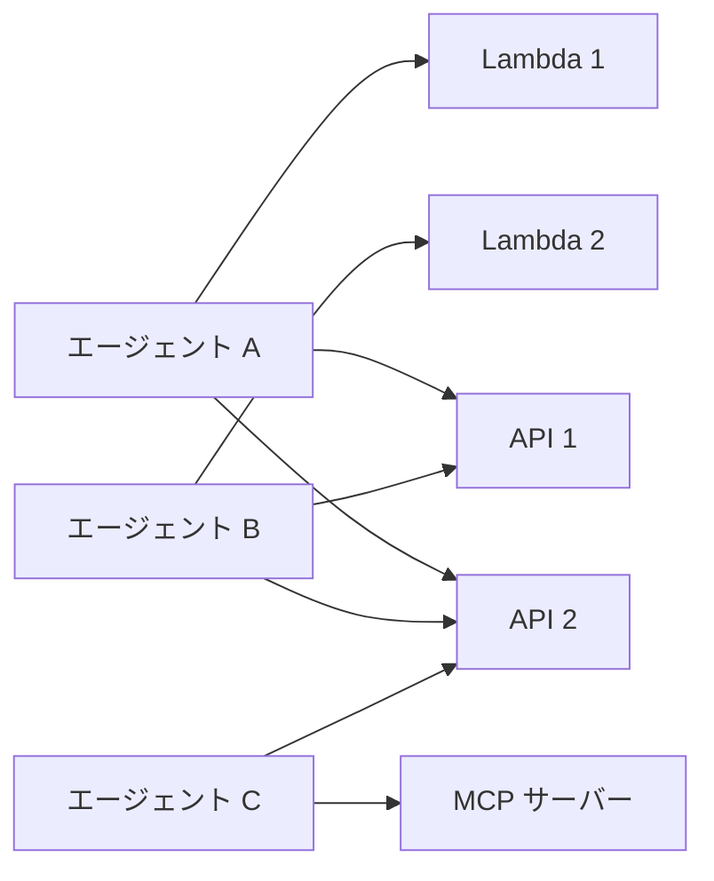
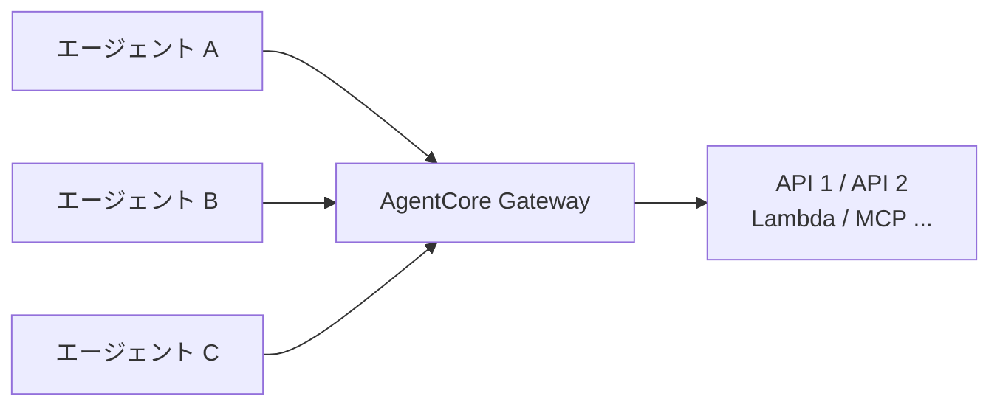
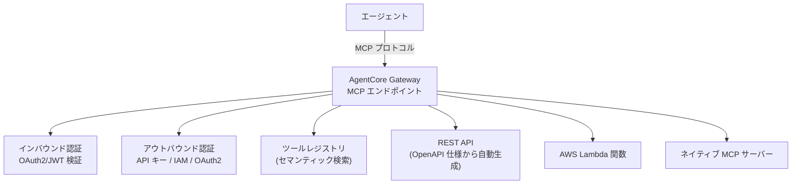

# AgentCore Gateway 詳細

> **調査日**: 2026-03-09  
> **情報の鮮度**: 2025年下半期時点の公式情報に基づく

---

## 概要

AgentCore Gateway は、REST API・AWS Lambda 関数・MCP（Model Context Protocol）サーバーをエージェントが利用できるツールとして統合する管理ゲートウェイです。多数のエージェントと多数のツールの間の M×N 統合問題を解決し、エージェント開発の複雑さを大幅に削減します。

---

## M×N 統合問題とその解決

**課題（M×N 統合）:**



**解決策（Gateway を中央ハブ化）:**



単一のゲートウェイエンドポイントを介してすべてのツールにアクセス可能となり、統合コードの重複と認証管理の複雑さを排除します。

---

## アーキテクチャ



---

## サポートする統合タイプ

### 1. REST API（OpenAPI/Smithy ベース）

- S3 にアップロードした OpenAPI 仕様（または インライン定義）から MCP ツールを自動生成
- コード変更なしで既存の REST API をエージェント向けツールとして公開
- API 仕様の更新時は `SynchronizeGateway` API で同期

### 2. AWS Lambda 関数

- Lambda 関数の入出力スキーマを定義してゲートウェイに登録
- サーバーレスバックエンドを MCP 互換ツールとして公開
- IAM ベースのアクセス制御で Lambda の呼び出し権限を管理

### 3. ネイティブ MCP サーバー

- 社内またはオープンソースの MCP サーバーエンドポイントを登録
- ゲートウェイがリクエストをルーティングし、認証を統合管理
- クライアント側でカスタム MCP クライアントロジックが不要

Gateway ↔ MCP サーバー間の認証方式・認証コンテキストの伝播・対応スキームの詳細は、[agentcore-gateway-mcp-auth.md](agentcore-gateway-mcp-auth.md) を参照してください。

---

## 主要機能

### セマンティックツール検索

```mermaid
flowchart LR
    Query["エージェント\n「ファイルを読み取れるツールが欲しい」"]
    Search["Gateway\nセマンティック検索"]
    Tool["\"read_file\" ツールを推薦"]

    Query --> Search --> Tool
```

自然言語クエリでエージェントが適切なツールを動的に発見・利用可能。

### 双方向認証管理

| 方向 | 認証方式 |
|------|---------|
| インバウンド（エージェント → Gateway） | OAuth2/JWT、AWS IAM |
| アウトバウンド（Gateway → 外部 API） | API キー、OAuth2、AWS IAM |

### SynchronizeGateway API

ツール定義のソース（OpenAPI 仕様など）から最新の状態に同期する API。API 仕様の変更を Gateway に自動反映できます。

---

## セットアップの流れ（OpenAPI ベースの例）

```python
import boto3

client = boto3.client("bedrock-agentcore")

# 1. Gateway を作成
gateway = client.create_gateway(
    name="my-api-gateway",
    roleArn="arn:aws:iam::ACCOUNT_ID:role/AgentCoreGatewayRole",
    gatewayExecutionRoleArn="arn:aws:iam::ACCOUNT_ID:role/GatewayExecutionRole",
)

# 2. OpenAPI 仕様から Gateway ターゲットを作成
target = client.create_gateway_target(
    gatewayId=gateway["gatewayId"],
    name="my-api-target",
    targetConfiguration={
        "openApiSpec": {
            "s3Location": {
                "bucket": "my-bucket",
                "key": "openapi-spec.yaml"
            }
        }
    }
)

# 3. 同期してツールを更新
client.synchronize_gateway(gatewayId=gateway["gatewayId"])
```

---

## エンタープライズ向けのメリット

| メリット | 説明 |
|---------|------|
| 運用の簡素化 | ツールタイプを問わず、単一のゲートウェイで一元管理 |
| セキュリティ | インバウンド/アウトバウンドの認証を統合管理 |
| ツールの統一化 | REST API、Lambda、MCP サーバーを共通インターフェースで利用 |
| スケーラビリティ | サーバーレスのマネージドインフラで自動スケーリング |
| コスト削減 | 各エージェントごとの個別統合コードが不要 |

---

## 参照リソース

- [AWS Blog: Introducing AgentCore Gateway](https://aws.amazon.com/blogs/machine-learning/introducing-amazon-bedrock-agentcore-gateway-transforming-enterprise-ai-agent-tool-development/)
- [AWS Blog: Unite MCP servers through AgentCore Gateway](https://aws.amazon.com/blogs/machine-learning/transform-your-mcp-architecture-unite-mcp-servers-through-agentcore-gateway/)
- [GitHub チュートリアル: Gateway](https://github.com/awslabs/amazon-bedrock-agentcore-samples/tree/main/01-tutorials/02-AgentCore-gateway)
  - [OpenAPI ベースの統合](https://github.com/awslabs/amazon-bedrock-agentcore-samples/tree/main/01-tutorials/02-AgentCore-gateway/01-openapi-spec)
  - [Lambda 統合](https://github.com/awslabs/amazon-bedrock-agentcore-samples/tree/main/01-tutorials/02-AgentCore-gateway/02-lambda-function)
  - [MCP サーバーをターゲットに](https://github.com/awslabs/amazon-bedrock-agentcore-samples/tree/main/01-tutorials/02-AgentCore-gateway/05-mcp-server-as-a-target)
- [Gateway Integration - bedrock-agentcore-starter-toolkit](https://aws.github.io/bedrock-agentcore-starter-toolkit/examples/gateway-integration.html)
- [Gateway アーキテクチャ - Simplifying AI Agent Scalability (CloudThat)](https://www.cloudthat.com/resources/blog/simplifying-ai-agent-scalability-with-amazon-bedrock-agentcore-gateway)
