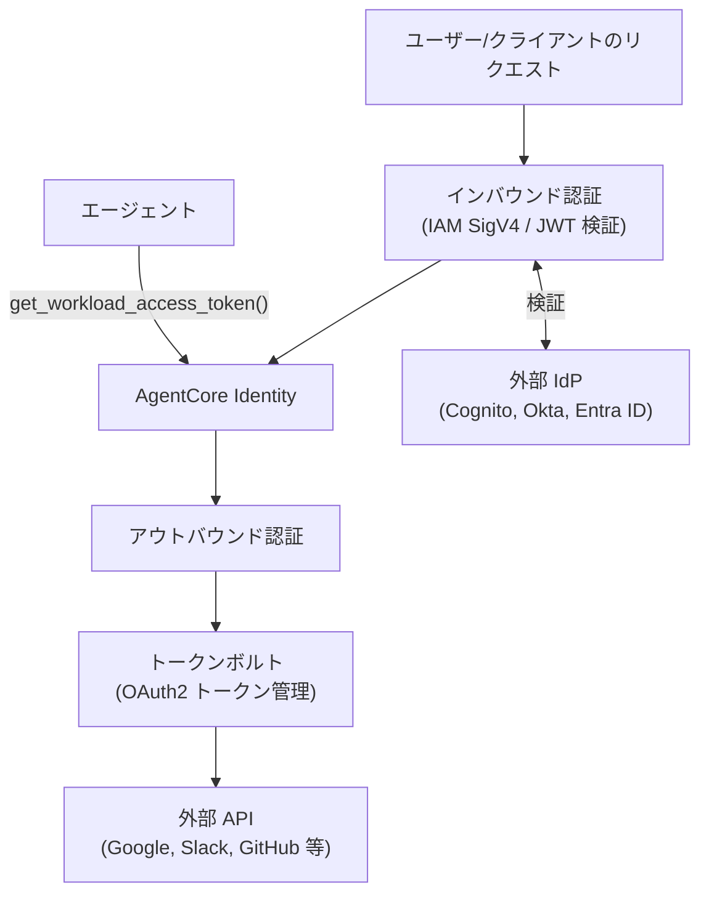

# AgentCore Identity 詳細

> **調査日**: 2026-03-09  
> **情報の鮮度**: 2025年下半期時点の公式情報に基づく

---

## 概要

AgentCore Identity は、AI エージェントとユーザーの認証・認可・資格情報ライフサイクルを管理するサービスです。エージェント自体の身元（ワークロード ID）と、エージェントが外部サービスを利用するための資格情報（アウトバウンド認証）を安全に管理します。

---

## 主要概念

### 1. ワークロード ID（Workload Identity）

- エージェントアプリケーション自体を認証主体として識別するための仕組み
- AgentCore Runtime 上では、ワークロード ID が自動的にプロビジョニングされ、エージェント実行環境に注入される
- ローカル開発時は `.agentcore.json` ファイルに資格情報を保存して使用
- 外部 API へアクセスするためのトークン取得に使用

### 2. インバウンド認証（Inbound Auth）

エージェントへのアクセスを制御する認証：

| 認証方法 | 説明 |
|----------|------|
| AWS IAM SigV4 | AWS 標準の署名付きリクエストによる認証 |
| JWT ベアラートークン | OIDC 準拠の JWT による認証（Cognito、Okta 等） |

OIDC 設定は、ディスカバリー URL とオーディエンス検証で構成します。

### 3. アウトバウンド認証（Outbound Auth）

エージェントが外部 API を呼び出す際の資格情報管理：

| 認証方法 | 説明 |
|----------|------|
| OAuth2 (2-Legged) | エージェント自体を主体としたクライアントクレデンシャルフロー |
| OAuth2 (3-Legged / 3LO) | ユーザーを代理した委任認可フロー（Google Drive、GitHub 等） |
| API キー | 静的 API キーによる外部サービス認証 |

### 4. トークンボルト（Token Vault）

- OAuth2 アクセストークン・リフレッシュトークンを安全に保管・管理
- トークンの取得・更新・セッション紐付けを自動処理
- KMS で暗号化されたシークレット管理

---

## アーキテクチャ



---

## セキュリティベストプラクティス

- `X-Amzn-Bedrock-AgentCore-Runtime-User-Id` ヘッダーの操作は信頼された IAM ロール/プリンシパルのみに制限
- `bedrock-agentcore:InvokeAgentRuntimeForUser` アクションは最小権限で付与
- ユーザー ID は認証済みの IAM/JWT コンテキストから取得し、なりすましを防止
- 監査ログを有効化して、委任アクションの追跡可能性を確保

---

## SDK での利用

```python
from bedrock_agentcore.identity import requires_access_token

@requires_access_token(provider="google", scopes=["https://www.googleapis.com/auth/drive.readonly"])
async def read_google_drive(access_token: str):
    # access_token は AgentCore Identity が自動的に取得・更新
    headers = {"Authorization": f"Bearer {access_token}"}
    # Google Drive API を呼び出す処理
```

---

## IaC 対応

**Terraform** での管理:
```hcl
resource "aws_bedrockagentcore_workload_identity" "my_agent" {
  name                      = "my-agent-workload-identity"
  allowed_oauth2_callback_urls = ["https://my-agent.example.com/callback"]
}
```

---

## 対応 IdP

| IdP | 対応 |
|-----|------|
| Amazon Cognito | ✅ |
| Okta | ✅ |
| Microsoft Entra ID (Azure AD) | ✅ |
| 任意の OIDC 準拠プロバイダー | ✅ |

---

## 参照リソース

- [AWS Docs: インバウンド/アウトバウンド認証](https://docs.aws.amazon.com/bedrock-agentcore/latest/devguide/runtime-oauth.html)
- [AWS Docs: OAuth2 アクセストークン取得](https://docs.aws.amazon.com/bedrock-agentcore/latest/devguide/identity-authentication.html)
- [Identity CLI Quickstart](https://aws.github.io/bedrock-agentcore-starter-toolkit/user-guide/identity/quickstart-with-cli.html)
- [GitHub チュートリアル: Identity](https://github.com/awslabs/amazon-bedrock-agentcore-samples/tree/main/01-tutorials/03-AgentCore-identity)
- [AgentCore Identity - 概要 (dev.to)](https://dev.to/aws-heroes/amazon-bedrock-agentcore-identity-part-1-introduction-and-overview-di1)
- [3LO (Google Drive) の実装例 (dev.classmethod)](https://dev.classmethod.jp/en/articles/amazon-bedrock-agentcore-identity-3lo-google-drive/)
- [Workload Identity - SDK Python (DeepWiki)](https://deepwiki.com/aws/bedrock-agentcore-sdk-python/4.1.4-workload-identity)
- [Terraform Provider: aws_bedrockagentcore_workload_identity](https://registry.terraform.io/providers/hashicorp/aws/latest/docs/resources/bedrockagentcore_workload_identity)
