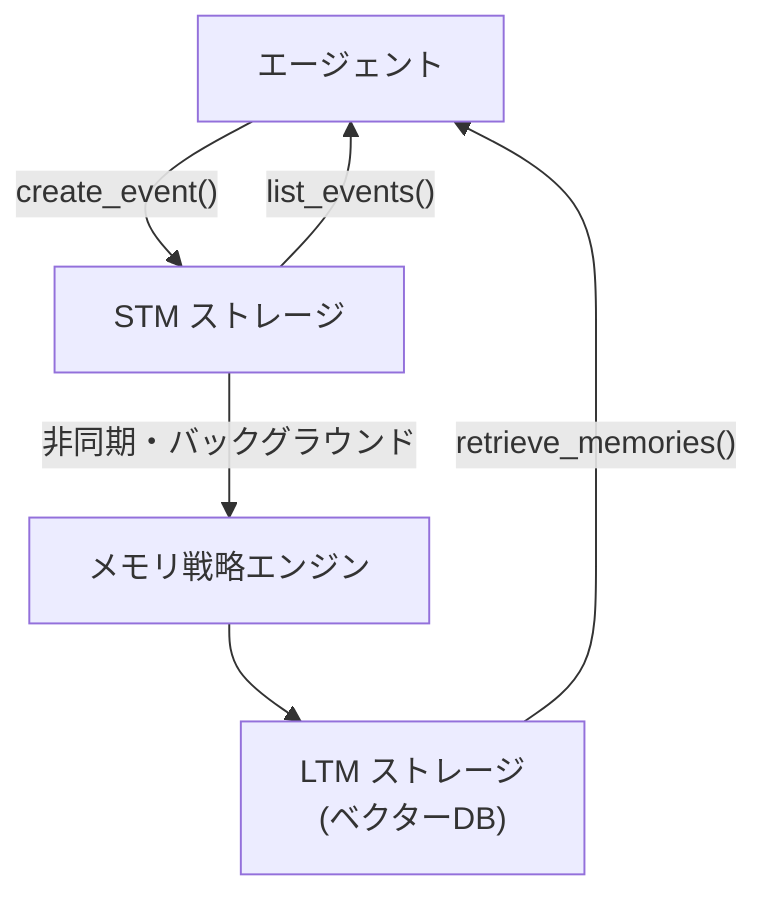

# AgentCore Memory 詳細

> **調査日**: 2026-03-09  
> **情報の鮮度**: 2025年下半期時点の公式情報に基づく

---

## 概要

AgentCore Memory は、AI エージェントがセッションを跨いで会話履歴・ユーザー設定・長期的知識を保持するためのフルマネージドメモリプラットフォームです。短期記憶（STM）と長期記憶（LTM）の 2 層構造を提供します。

---

## メモリの種類

### 短期記憶（Short-Term Memory / STM）

- セッション内の会話イベント（ユーザー発話・エージェント応答）をリアルタイムに記録
- `session_id` と `actor_id` に紐づいたイベントとして保存
- 現在進行中のセッションでの文脈維持に使用
- 保持期間: 設定可能（数日程度が一般的）

### 長期記憶（Long-Term Memory / LTM）

- STM のデータを非同期のメモリ戦略で分析・構造化し、重要情報を抽出
- ユーザーの嗜好・重要なファクト・サマリーをセッションを跨いで保持
- ベクターデータベース（OpenSearch Serverless）に保存し、セマンティック検索で取得
- データ抽出はイベント保存から約 1 分後に利用可能

---

## アーキテクチャ



---

## メモリ戦略

LTM への情報抽出方法を定義するカスタマイズ可能な戦略:

| 戦略タイプ | 説明 |
|-----------|------|
| セマンティック抽出 | 会話から重要なファクト・エンティティを自動抽出 |
| サマリー | 会話の要約を生成・保存 |
| ユーザー設定 | ユーザーの好み・設定情報を構造化して保存 |
| カスタム | ビジネス要件に応じたカスタムスキーマ・カテゴリを定義 |

---

## 主要な API

| API | 説明 |
|-----|------|
| `create_event()` | 会話イベント（STM）を記録 |
| `list_events()` | 過去の会話イベントを取得 |
| `retrieve_memories()` | セマンティッククエリで LTM を検索・取得 |

---

## セキュリティ

- すべてのメモリイベントは暗号化（保存時・転送時）
- IAM ロール・ポリシーによるアクセス制御
- ネームスペースによる論理的な分離（ユーザー単位、メモリ戦略単位等）

---

## フレームワーク統合

**Strands Agents との統合例:**
```python
from strands import Agent
from bedrock_agentcore.memory import BedrockAgentCoreMemoryClient

# AgentCore Memory をセッションマネージャーとして利用
agent = Agent(
    session_manager=agentcore_memory_session_manager,
    # ...
)
```

Strands Agents 等のフレームワークでは、セッションマネージャーとして AgentCore Memory を統合することで、STM・LTM の管理を自動化できます。

---

## 参照リソース

- [AWS Docs: AgentCore Memory はじめに](https://docs.aws.amazon.com/bedrock-agentcore/latest/devguide/memory-get-started.html)
- [Memory Quickstart - bedrock-agentcore-starter-toolkit](https://aws.github.io/bedrock-agentcore-starter-toolkit/user-guide/memory/quickstart.html)
- [GitHub チュートリアル: Memory](https://github.com/awslabs/amazon-bedrock-agentcore-samples/tree/main/01-tutorials/04-AgentCore-memory)
- [Amazon AgentCore Memory - Strands Agents 統合](https://strandsagents.com/latest/documentation/docs/community/session-managers/agentcore-memory/)
- [AgentCore Memory Cheat Sheet (Tutorials Dojo)](https://tutorialsdojo.com/amazon-bedrock-agentcore-memory-cheat-sheet/)
- [Memory Architecture Deep Dive (DeepWiki)](https://deepwiki.com/aws-samples/sample-bedrock-agentcore-with-strands-and-nova/5.5-memory-architecture)
