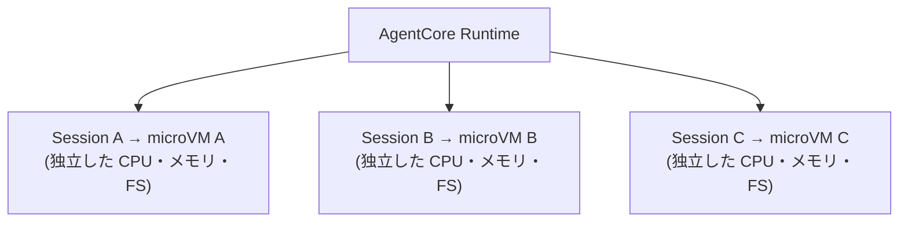
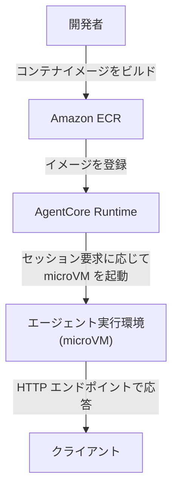

# AgentCore Runtime 詳細

> **調査日**: 2026-03-09  
> **情報の鮮度**: 2025年下半期時点の公式情報に基づく

---

## 概要

AgentCore Runtime は、AI エージェントをサーバーレスで安全に実行するためのコンテナ実行基盤です。AWS Firecracker の microVM 技術を活用したセッション分離により、エンタープライズレベルのセキュリティを提供します。

---

## アーキテクチャ

### microVM によるセッション分離



- 各セッションは専用の Firecracker microVM 上で動作
- セッション間でのデータアクセスは不可（完全分離）
- セッション終了時に microVM を廃棄し、すべてのリソースをサニタイズ
- メモリ・ディスクはエフェメラル（永続データは Memory 等の外部サービスに保存）

### デプロイモデル



---

## 主要な仕様・制限

| 項目 | 値 |
|------|-----|
| 最大セッション時間 | 8 時間 |
| アイドルタイムアウト | 約 15 分（設定による） |
| 同時セッション数（上限） | アカウントあたり最大 3,000 |
| コンテナアーキテクチャ | ARM64 推奨 |
| 対応エージェントフレームワーク | LangGraph, Strands Agents, CrewAI, カスタム等（任意） |
| 対応モデルプロバイダー | Amazon Bedrock, OpenAI, Anthropic, オープンソース等 |

---

## セキュリティ

- **ゼロトラストセッション境界**: 各セッションはネットワーク・計算リソース・ファイルシステムが完全に分離
- **特権操作の閉じ込め**: 外部 API 呼び出し・コード実行・ファイル操作はすべて microVM 内に閉じ込め
- **資格情報の漏洩防止**: セッション内の資格情報・シークレットはセッション境界を越えない
- **ロギング・監査**: CloudWatch 統合による詳細なセッションログと監査証跡

---

## 可観測性

- **CloudWatch 統合**: セッションログ・パフォーマンスメトリクスを自動収集
- **カスタムソリューション**: OpenTelemetry ベースの外部監視ツールとの統合も可能

---

## SDK・ツール

- **bedrock-agentcore-starter-toolkit**: エージェントのコンテナ化・デプロイを簡略化する Python SDK
- **`@app.entrypoint` デコレータ**: エージェントの HTTP エンドポイントを定義するためのシンプルな API

```python
from bedrock_agentcore.runtime import BedrockAgentCoreApp

app = BedrockAgentCoreApp()

@app.entrypoint
def invoke(payload, context):
    # エージェントのロジックをここに実装
    user_input = payload.get("prompt", "")
    response = my_agent(user_input)
    return {"response": response}
```

---

## 参照リソース

- [AWS Docs: セッション分離](https://docs.aws.amazon.com/bedrock-agentcore/latest/devguide/runtime-sessions.html)
- [bedrock-agentcore-starter-toolkit クイックスタート](https://aws.github.io/bedrock-agentcore-starter-toolkit/examples/agentcore-quickstart-example.html)
- [GitHub チュートリアル: Runtime](https://github.com/awslabs/amazon-bedrock-agentcore-samples/tree/main/01-tutorials/01-AgentCore-runtime)
- [Building AI Agents with AgentCore Runtime (dev.to)](https://dev.to/aws-builders/building-ai-agents-with-amazon-bedrock-agentcore-runtime-a-complete-setup-guide-50oh)
- [Guidance for Multi-Agent Orchestration using AgentCore](https://github.com/aws-solutions-library-samples/guidance-for-multi-agent-orchestration-using-bedrock-agentcore-on-aws)
