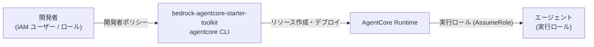

# IAM ポリシーサンプル

> **更新日**: 2026-03-09  
> **セキュリティ原則**: 最小権限の原則に従い、本番環境では必要最小限の権限のみを付与してください

---

## 概要

AgentCore を使ったエージェント開発・デプロイには、2 種類の IAM ロール / ポリシーが必要です。



| ロール | 目的 | 付与対象 |
|--------|------|----------|
| **開発者用ポリシー** | `agentcore` CLI によるリソース作成・デプロイ操作を許可 | 開発者の IAM ユーザー / ロール |
| **エージェント実行ロール** | AgentCore Runtime がエージェントを起動・実行する際に使用 | `bedrock-agentcore.amazonaws.com` サービス |

---

## 1. 開発者用 IAM ポリシー

`agentcore` CLI を使ったデプロイ・管理操作に必要な権限です。

> **注意**: このポリシーは開発環境向けの設定です。本番環境では Resource ARN を具体的に指定し、不要なアクションを削除してください。

### developer-policy.json

```json
{
  "Version": "2012-10-17",
  "Statement": [
    {
      "Sid": "AgentCoreRuntimeAccess",
      "Effect": "Allow",
      "Action": [
        "bedrock-agentcore:CreateAgentRuntime",
        "bedrock-agentcore:UpdateAgentRuntime",
        "bedrock-agentcore:DeleteAgentRuntime",
        "bedrock-agentcore:GetAgentRuntime",
        "bedrock-agentcore:ListAgentRuntimes",
        "bedrock-agentcore:CreateAgentRuntimeEndpoint",
        "bedrock-agentcore:DeleteAgentRuntimeEndpoint",
        "bedrock-agentcore:GetAgentRuntimeEndpoint",
        "bedrock-agentcore:ListAgentRuntimeEndpoints",
        "bedrock-agentcore:InvokeAgentRuntime"
      ],
      "Resource": "*"
    },
    {
      "Sid": "IAMRoleManagement",
      "Effect": "Allow",
      "Action": [
        "iam:CreateRole",
        "iam:DeleteRole",
        "iam:GetRole",
        "iam:PutRolePolicy",
        "iam:DeleteRolePolicy",
        "iam:AttachRolePolicy",
        "iam:DetachRolePolicy",
        "iam:TagRole",
        "iam:ListRolePolicies",
        "iam:ListAttachedRolePolicies"
      ],
      "Resource": [
        "arn:aws:iam::*:role/*BedrockAgentCore*",
        "arn:aws:iam::*:role/service-role/*BedrockAgentCore*"
      ]
    },
    {
      "Sid": "IAMPassRole",
      "Effect": "Allow",
      "Action": [
        "iam:PassRole"
      ],
      "Resource": [
        "arn:aws:iam::*:role/AmazonBedrockAgentCore*",
        "arn:aws:iam::*:role/service-role/AmazonBedrockAgentCore*"
      ]
    },
    {
      "Sid": "ECRAccess",
      "Effect": "Allow",
      "Action": [
        "ecr:CreateRepository",
        "ecr:DeleteRepository",
        "ecr:DescribeRepositories",
        "ecr:GetAuthorizationToken",
        "ecr:BatchCheckLayerAvailability",
        "ecr:InitiateLayerUpload",
        "ecr:UploadLayerPart",
        "ecr:CompleteLayerUpload",
        "ecr:PutImage",
        "ecr:BatchGetImage",
        "ecr:GetDownloadUrlForLayer",
        "ecr:TagResource"
      ],
      "Resource": "*"
    },
    {
      "Sid": "CodeBuildAccess",
      "Effect": "Allow",
      "Action": [
        "codebuild:StartBuild",
        "codebuild:BatchGetBuilds",
        "codebuild:ListBuildsForProject",
        "codebuild:CreateProject",
        "codebuild:UpdateProject",
        "codebuild:BatchGetProjects"
      ],
      "Resource": [
        "arn:aws:codebuild:*:*:project/bedrock-agentcore-*",
        "arn:aws:codebuild:*:*:build/bedrock-agentcore-*"
      ]
    },
    {
      "Sid": "CodeBuildListAccess",
      "Effect": "Allow",
      "Action": [
        "codebuild:ListProjects"
      ],
      "Resource": "*"
    },
    {
      "Sid": "BedrockModelAccess",
      "Effect": "Allow",
      "Action": [
        "bedrock:InvokeModel",
        "bedrock:InvokeModelWithResponseStream",
        "bedrock:ListFoundationModels",
        "bedrock:GetFoundationModel"
      ],
      "Resource": "*"
    },
    {
      "Sid": "CloudWatchLogsAccess",
      "Effect": "Allow",
      "Action": [
        "logs:CreateLogGroup",
        "logs:CreateLogStream",
        "logs:PutLogEvents",
        "logs:DescribeLogGroups",
        "logs:DescribeLogStreams",
        "logs:GetLogEvents"
      ],
      "Resource": "arn:aws:logs:*:*:log-group:/aws/bedrock-agentcore/*"
    }
  ]
}
```

### CLI での作成手順

```bash
# 1. ポリシードキュメントをファイルに保存（上記 JSON を developer-policy.json として保存）

# 2. IAM ポリシーを作成する
aws iam create-policy \
  --policy-name AgentCoreDeveloperPolicy \
  --policy-document file://developer-policy.json \
  --description "Amazon Bedrock AgentCore 開発者用ポリシー（開発環境向け）"

# 3. IAM ユーザー / ロールにポリシーをアタッチする
aws iam attach-user-policy \
  --user-name YOUR_IAM_USER \
  --policy-arn arn:aws:iam::$(aws sts get-caller-identity --query Account --output text):policy/AgentCoreDeveloperPolicy
```

---

## 2. エージェント実行ロール

AgentCore Runtime がエージェントコンテナを起動・実行する際に使用するロールです。

### 2-1. 信頼ポリシー（Trust Policy）

`bedrock-agentcore.amazonaws.com` サービスのみがこのロールを引き受けられるように設定します。

> `123456789012` を実際の AWS アカウント ID に、`us-east-1` を使用するリージョンに置き換えてください。

```json
{
  "Version": "2012-10-17",
  "Statement": [
    {
      "Sid": "AssumeRolePolicy",
      "Effect": "Allow",
      "Principal": {
        "Service": "bedrock-agentcore.amazonaws.com"
      },
      "Action": "sts:AssumeRole",
      "Condition": {
        "StringEquals": {
          "aws:SourceAccount": "123456789012"
        },
        "ArnLike": {
          "aws:SourceArn": "arn:aws:bedrock-agentcore:us-east-1:123456789012:*"
        }
      }
    }
  ]
}
```

> **セキュリティノート**: `Condition` 句により、同一アカウント・同一リージョンの AgentCore リソースのみがこのロールを引き受けられるよう制限しています。これは "Confused Deputy" 問題の対策です。

### 2-2. 権限ポリシー（Permissions Policy）

実行ロールに付与する最小限の権限ポリシーです。

```json
{
  "Version": "2012-10-17",
  "Statement": [
    {
      "Sid": "BedrockModelInvoke",
      "Effect": "Allow",
      "Action": [
        "bedrock:InvokeModel",
        "bedrock:InvokeModelWithResponseStream"
      ],
      "Resource": "*"
    },
    {
      "Sid": "CloudWatchLogs",
      "Effect": "Allow",
      "Action": [
        "logs:CreateLogGroup",
        "logs:CreateLogStream",
        "logs:PutLogEvents"
      ],
      "Resource": "arn:aws:logs:*:*:log-group:/aws/bedrock-agentcore/*"
    },
    {
      "Sid": "ECRImagePull",
      "Effect": "Allow",
      "Action": [
        "ecr:GetDownloadUrlForLayer",
        "ecr:BatchGetImage",
        "ecr:GetAuthorizationToken"
      ],
      "Resource": "*"
    }
  ]
}
```

> **拡張時の追加権限**: Memory・Gateway などを使う場合は以下を追加してください。
> - Memory: `bedrock-agentcore:GetMemory`, `bedrock-agentcore:PutMemoryRecord` など
> - Secrets Manager: `secretsmanager:GetSecretValue`（外部 API キー使用時）

### 2-3. CLI での作成手順

```bash
# 1. 信頼ポリシーを trust-policy.json として保存（上記 JSON）

# 2. 実行ロールを作成する
aws iam create-role \
  --role-name AgentCoreExecutionRole \
  --assume-role-policy-document file://trust-policy.json \
  --description "Amazon Bedrock AgentCore エージェント実行ロール"

# 3. 権限ポリシーを execution-policy.json として保存（上記 JSON）

# 4. インラインポリシーをアタッチする
aws iam put-role-policy \
  --role-name AgentCoreExecutionRole \
  --policy-name AgentCoreExecutionPolicy \
  --policy-document file://execution-policy.json

# 5. ロール ARN を確認する（デプロイ時に使用）
aws iam get-role \
  --role-name AgentCoreExecutionRole \
  --query 'Role.Arn' \
  --output text
```

---

## 3. Starter Toolkit による自動作成

`bedrock-agentcore-starter-toolkit` を使う場合、`agentcore deploy` コマンドが IAM ロールを自動的に作成します。自動作成されるロール名のパターン:

- 実行ロール: `AmazonBedrockAgentCoreSDKRuntime-{プロジェクト名}`
- CodeBuild ロール: `AmazonBedrockAgentCoreSDKCodeBuild-{プロジェクト名}`

自動作成を使う場合でも、開発者の IAM ユーザー / ロールには [1. 開発者用 IAM ポリシー](#1-開発者用-iam-ポリシー) の権限が必要です。

---

## 参照リンク

- [AWS 公式: AgentCore Runtime IAM 権限](https://docs.aws.amazon.com/bedrock-agentcore/latest/devguide/runtime-permissions.html)
- [AWS 公式: AgentCore セキュリティと IAM](https://docs.aws.amazon.com/bedrock-agentcore/latest/devguide/security-iam.html)
- [Starter Toolkit 権限ガイド (GitHub)](https://github.com/aws/bedrock-agentcore-starter-toolkit/blob/main/documentation/docs/user-guide/runtime/permissions.md)
- [セットアップガイド目次](index.md)
