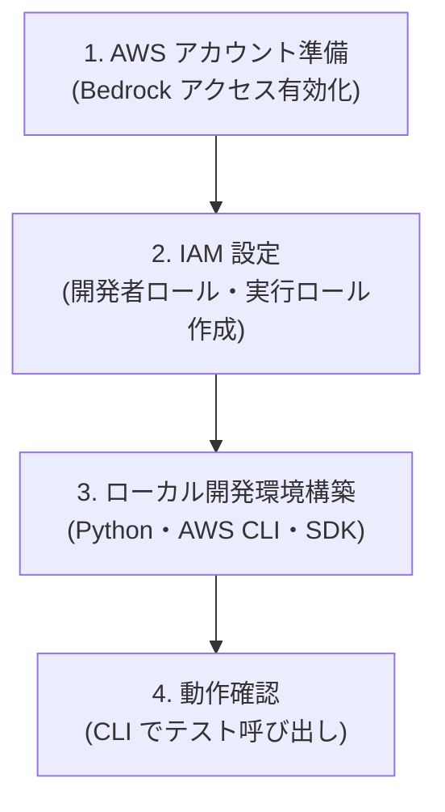

# 開発環境・前提条件セットアップガイド

> **対象読者**: Amazon Bedrock AgentCore を使ってエージェント開発を始めようとしている開発者  
> **更新日**: 2026-03-09  
> **依存タスク**: Task 3 AgentCore ファミリー全体概要調査（完了済み）

---

## このガイドの目的

AgentCore ファミリーを使ったエージェント開発を開始するために必要な、AWS 環境とローカル開発環境のセットアップ手順をまとめます。このガイドに沿って作業することで、誰でも再現可能な状態になることを目指します。

---

## セットアップの全体像

---

## ドキュメント構成

| ドキュメント | 内容 |
|--------------|------|
| [aws-environment.md](aws-environment.md) | AWS アカウント準備・Amazon Bedrock モデルアクセス有効化 |
| [iam-policies.md](iam-policies.md) | IAM ポリシーサンプル（開発者用・エージェント実行ロール用） |
| [local-development.md](local-development.md) | ローカル開発環境（Python・AWS CLI・bedrock-agentcore-starter-toolkit）のセットアップ |

---

## 前提条件チェックリスト

以下の項目をすべて満たすことでエージェント開発を開始できます。

### AWS 環境
- [ ] AWS アカウントを取得し、請求情報が設定されている
- [ ] 対象リージョン（例: `us-east-1`）で Amazon Bedrock が利用可能
- [ ] 使用するモデル（例: Anthropic Claude）のアクセスが有効化されている
- [ ] 開発者用 IAM ユーザー / ロールが作成され、必要な権限が付与されている
- [ ] AgentCore Runtime 用の実行ロールが作成されている

### ローカル環境
- [ ] Python 3.10 以上がインストールされている
- [ ] AWS CLI v2 がインストールされ、認証情報が設定されている
- [ ] `bedrock-agentcore-starter-toolkit` がインストールされている
- [ ] `agentcore --help` が正常に実行できる

---

## 対応リージョン

Amazon Bedrock AgentCore は、2025年時点では以下のリージョンで利用可能です（詳細は AWS 公式ドキュメントを確認してください）。

- `us-east-1` (米国東部: バージニア北部) ← **推奨**
- `us-west-2` (米国西部: オレゴン)
- `eu-west-1` (欧州: アイルランド)

> **注意**: AgentCore の各コンポーネントによって対応リージョンが異なる場合があります。最新情報は [AWS リージョン別サービス一覧](https://aws.amazon.com/about-aws/global-infrastructure/regional-product-services/) を参照してください。

---

## 参照リンク

- [AWS 公式: Amazon Bedrock AgentCore Developer Guide](https://docs.aws.amazon.com/bedrock-agentcore/latest/devguide/)
- [bedrock-agentcore-starter-toolkit (GitHub)](https://github.com/aws/bedrock-agentcore-starter-toolkit)
- [bedrock-agentcore-starter-toolkit (PyPI)](https://pypi.org/project/bedrock-agentcore-starter-toolkit/)
- [masterplan.md](../masterplan.md)
